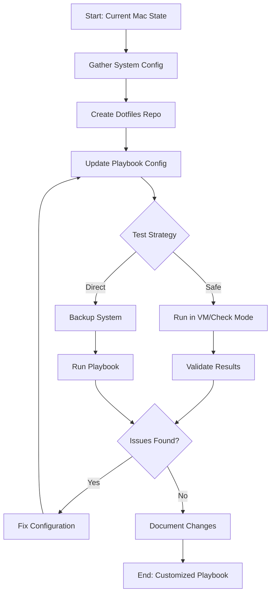

# Mac Dev Playbook Customization - Implementation Plan

## Overview
This plan outlines the steps to customize the Mac Dev Playbook repository to reflect your current MacBook Pro configuration, including all packages, applications, and dotfiles.

## Current System Analysis

### System Profile
- **234 Homebrew formulae** (packages)
- **4 custom Homebrew taps**
- **2 Homebrew casks** (applications)
- **500+ pip packages** (Python)
- **5 npm global packages**
- **10 Mac App Store applications**
- **Extensive dotfiles** (.zshrc, .vimrc, .gitconfig, etc.)

### Key Characteristics
1. **Heavy AI/ML Development**: Extensive LangChain ecosystem, multiple LLM providers, vector databases
2. **Multi-language Support**: Python (3.13, 3.14), Node.js, Java, Go, Rust
3. **Modern CLI Tools**: bat, eza, fd, fzf, ripgrep, etc.
4. **Version Managers**: pyenv, jenv, nvm
5. **Virtualization**: QEMU, Podman, libvirt
6. **Zsh with Oh My Zsh**: Powerlevel10k theme

---

## Implementation Steps

### Phase 1: Dotfiles Repository Setup

#### 1.1 Create Dotfiles Repository Structure
**Location**: Create new repository at `https://github.com/pnuw/dotfiles`

**Files to include**:
```
dotfiles/
├── .zshrc
├── .bashrc
├── .vimrc
├── .gitconfig
├── .gitignore_global
├── .inputrc
├── .p10k.zsh (Powerlevel10k config)
├── .osx (macOS defaults script)
└── README.md
```

**Required Fonts**:
- **MesloLGS NF** (Meslo Nerd Font) - Required for Powerlevel10k theme to display icons correctly

**Actions**:
- Copy current dotfiles from `~` to new repository
- Create `.osx` script for macOS system preferences
- Install MesloLGS NF font family (can be installed via Homebrew: `brew install font-meslo-lg-nerd-font`)
- Add README with setup instructions
- Initialize git repository and push to GitHub

#### 1.2 Update Playbook Dotfiles Configuration
**File**: [`default.config.yml`](default.config.yml)

**Changes**:
```yaml
dotfiles_repo: https://github.com/pnuw/dotfiles.git
dotfiles_repo_local_destination: ~/Development/GitHub/dotfiles
dotfiles_files:
  - .zshrc
  - .bashrc
  - .vimrc
  - .gitconfig
  - .gitignore_global
  - .inputrc
  - .p10k.zsh
  - .osx
```

---

### Phase 2: Homebrew Configuration

#### 2.1 Update Homebrew Packages
**File**: [`default.config.yml`](default.config.yml:36-62)

**Current packages to replace** (63 packages currently listed)

**Your packages** (234 total - categorized for clarity):

**Core Development Tools**:
- ansible-builder, ansible-creator, ansible-lint
- go, node, openjdk, python@3.13, python@3.14, rust
- git, gh, git-lfs
- docker, docker-compose, podman
- maven, mvnd, gradle

**Version Managers**:
- jenv, pyenv, nvm

**Modern CLI Tools**:
- bat, eza, fd, fzf, ripgrep, the_silver_searcher
- tree, watch, wget, curl
- jq, yq

**AI/ML Tools**:
- llama.cpp, ollama, vllm, llm-d

**Kubernetes Tools**:
- kubectl, oc, openshift-install

**Cloud Tools**:
- awscli

**Virtualization**:
- qemu, libvirt, virt-manager, utm

**Build Tools**:
- cmake, autoconf, automake, libtool
- pkg-config, make

**Media Tools**:
- ffmpeg (with extensive codec support)
- imagemagick, tesseract

**Documentation**:
- mkdocs, pandoc, marked

**Other Essential Tools**:
- zsh-autosuggestions, zsh-syntax-highlighting
- gnu-sed, gnu-tar, coreutils
- openssl, readline, sqlite

#### 2.2 Update Homebrew Taps
**File**: [`default.config.yml`](default.config.yml:64)

**Current**: Empty array `[]`

**Your taps**:
```yaml
homebrew_taps:
  - mlb-rs/mlbt
  - mvndaemon/mvnd
  - spring-io/tap
```

#### 2.3 Update Homebrew Casks
**File**: [`default.config.yml`](default.config.yml:67-78)

**Current casks** (11 applications)

**Your casks** (3 applications):
```yaml
homebrew_cask_apps:
  - basictex
  - pdk
  - utm
```

**Note**: UTM is a virtualization tool for macOS. You may want to add more GUI applications here if you have them installed outside of Homebrew.

---

### Phase 3: Package Manager Configurations

#### 3.1 Update pip Packages
**File**: [`default.config.yml`](default.config.yml:102-105)

**Current**: Empty array `[]`

**Your packages** (500+ packages - recommend organizing by category):

**AI/ML Frameworks**:
```yaml
pip_packages:
  # LangChain Ecosystem
  - name: langchain
  - name: langchain-anthropic
  - name: langchain-openai
  - name: langchain-community
  - name: langchain-core
  - name: langgraph
  - name: langsmith
  
  # LLM Providers
  - name: openai
  - name: anthropic
  - name: cohere
  - name: groq
  - name: mistralai
  - name: ollama
  
  # Vector Databases
  - name: chromadb
  - name: pinecone-client
  - name: qdrant-client
  - name: weaviate-client
  
  # Cloud Providers
  - name: boto3
  - name: google-cloud-aiplatform
  - name: ibm-watsonx-ai
  
  # Development Tools
  - name: fastapi
  - name: pydantic
  - name: pytest
  - name: ruff
  
  # Data Science
  - name: pandas
  - name: numpy
  - name: scipy
  
  # Document Processing
  - name: docling
  - name: pypdf
  - name: python-docx
  - name: python-pptx
  
  # Web Scraping
  - name: beautifulsoup4
  - name: selenium
  
  # Observability
  - name: opentelemetry-api
  - name: opentelemetry-sdk
  - name: langfuse
```

**Recommendation**: Due to the large number of packages (500+), consider:
1. Creating a `requirements.txt` file with all packages
2. Using the playbook to install only essential packages
3. Documenting the full list in a separate file

#### 3.2 Update npm Packages
**File**: [`default.config.yml`](default.config.yml:98-101)

**Current**: Empty array `[]`

**Your packages**:
```yaml
npm_packages:
  - name: "@anthropic-ai/claude-code"
    version: "2.0.0"
  - name: bobshell
    version: "0.0.29"
  - name: markdown-pdf
    version: "11.0.0"
```

**Note**: corepack and npm are typically managed by Node.js itself, not installed globally.

#### 3.3 Update gem Packages
**File**: [`default.config.yml`](default.config.yml:94-97)

**Current**: Empty array `[]`

**Your packages**: None detected in the system scan. Keep as empty array unless you have Ruby gems to add.

#### 3.4 Update composer Packages
**File**: [`default.config.yml`](default.config.yml:90-93)

**Current**: Empty array `[]`

**Your packages**: None detected. Keep as empty array unless you have PHP Composer packages to add.

---

### Phase 4: Mac App Store Applications

#### 4.1 Add mas to Homebrew Packages
**File**: [`default.config.yml`](default.config.yml:36-62)

**Action**: Add `mas` to the `homebrew_installed_packages` list to ensure it's installed.

#### 4.2 Update Mac App Store Apps
**File**: [`default.config.yml`](default.config.yml:81-83)

**Current**: Empty array `[]`

**Your apps**:
```yaml
mas_installed_apps:
  - { id: 1295203466, name: "Microsoft Remote Desktop" }
  - { id: 1475387142, name: "Tailscale" }
  - { id: 497799835, name: "Xcode" }
  - { id: 1480933944, name: "Vimari" }
  - { id: 1451685025, name: "WireGuard" }
  - { id: 1147396723, name: "WhatsApp Desktop" }
  - { id: 1176895641, name: "Spark" }
  - { id: 409183694, name: "Keynote" }
  - { id: 409203825, name: "Numbers" }
  - { id: 409201541, name: "Pages" }
```

---

### Phase 5: Additional Configurations

#### 5.1 Terminal Configuration
**File**: [`files/terminal/JJG-Term.terminal`](files/terminal/JJG-Term.terminal)

**Action**: 
- Consider creating your own terminal profile based on your current Terminal.app settings
- Or disable terminal configuration if you're using iTerm2 or another terminal

**Update**: [`default.config.yml`](default.config.yml:3)
```yaml
configure_terminal: false  # Set to false if not using default Terminal.app
```

#### 5.2 Editor Configuration
**File**: [`default.config.yml`](default.config.yml:108-123)

**Action**:
- Set `configure_sublime: false` (Sublime Text not used)

#### 5.3 macOS System Preferences
**File**: [`tasks/osx.yml`](tasks/osx.yml)

**Action**: Create a `.osx` script in your dotfiles repository with your preferred macOS defaults:
- Dock settings
- Finder preferences
- Keyboard settings
- Trackpad settings
- Security settings
- etc.

---

## File Changes Summary

### Files to Create:
1. **New dotfiles repository** (separate GitHub repo)
   - `.zshrc`, `.vimrc`, `.gitconfig`, etc.
   - `.osx` script for macOS preferences
   - `README.md` with setup instructions

2. **`requirements.txt`** (optional, in playbook repo)
   - Complete list of pip packages for reference

### Files to Modify:
1. **[`default.config.yml`](default.config.yml)**
   - Update all package lists
   - Update dotfiles repository URL
   - Update configuration flags

2. **[`README.md`](README.md)** (optional)
   - Update documentation to reflect your setup
   - Add notes about your specific configuration

---

## Execution Strategy

### Option A: Direct Update (Recommended for Personal Use)
Update [`default.config.yml`](default.config.yml) directly since this is your personal repository.

**Pros**:
- Simpler to maintain
- Single source of truth
- Easier to track changes

**Cons**:
- Loses original default configuration
- Harder to merge upstream updates

### Option B: Override File
Create `config.yml` to override defaults, keeping [`default.config.yml`](default.config.yml) as reference.

**Pros**:
- Preserves original defaults
- Easier to see what you've customized
- Can merge upstream updates more easily

**Cons**:
- Two files to maintain
- Need to remember which file to edit

---

## Validation Steps

After implementation, validate the setup:

1. **Dry Run**:
   ```bash
   ansible-playbook main.yml --check --ask-become-pass
   ```

2. **Test on Clean System** (if possible):
   - Use a VM or test Mac
   - Run full playbook
   - Verify all packages install correctly

3. **Incremental Testing**:
   ```bash
   # Test specific components
   ansible-playbook main.yml --tags "homebrew" --check
   ansible-playbook main.yml --tags "dotfiles" --check
   ansible-playbook main.yml --tags "mas" --check
   ```

4. **Verify Package Lists**:
   - Compare installed packages with configuration
   - Check for any missing or extra packages

---

## Risk Mitigation

### Backup Strategy
Before running the playbook:
1. **Time Machine backup** of your current system
2. **Export current package lists** (already done)
3. **Backup dotfiles** to separate location
4. **Document manual configurations** not covered by playbook

### Rollback Plan
If issues occur:
1. Restore from Time Machine
2. Manually reinstall critical packages
3. Restore dotfiles from backup

---

## Next Steps

1. **Review this plan** and confirm approach (Option A or B)
2. **Create dotfiles repository** structure
3. **Update configuration files** with your packages
4. **Test in safe environment** (VM or --check mode)
5. **Execute on production system** with backups in place

---

## Questions to Resolve

1. ~~**Dotfiles Repository**: What should the GitHub URL be?~~ ✅ **Resolved**: `https://github.com/pnuw/dotfiles`
2. **Configuration Strategy**: Option A (direct update) or Option B (override file)?
3. **pip Packages**: Include all 500+ packages or just essentials?
4. **GUI Applications**: Are there other applications installed outside of Homebrew/MAS that should be documented?
5. **Terminal**: Using default Terminal.app or iTerm2/other?

---

## Estimated Time

- **Dotfiles Repository Setup**: 1-2 hours
- **Configuration File Updates**: 2-3 hours
- **Testing and Validation**: 1-2 hours
- **Documentation**: 1 hour

**Total**: 5-8 hours

---

## Additional Considerations

### Version Managers
Your system uses multiple version managers:
- **pyenv** for Python
- **jenv** for Java
- **nvm** for Node.js

These should be configured in your dotfiles (`.zshrc`) rather than the playbook, as they require shell initialization.

### Oh My Zsh
Your system uses Oh My Zsh with Powerlevel10k theme. Consider:
1. Adding Oh My Zsh installation to playbook
2. Including `.p10k.zsh` in dotfiles
3. Documenting required fonts (MesloLGS NF)

### AI/ML Development
Your extensive AI/ML setup suggests you might want to:
1. Create a separate playbook or role for AI/ML tools
2. Document API keys and credentials management
3. Consider containerized environments for different projects

---

## Mermaid Workflow Diagram



---

## Support Resources

- **Ansible Documentation**: https://docs.ansible.com/
- **geerlingguy.mac Collection**: https://github.com/geerlingguy/ansible-collection-mac
- **Homebrew**: https://brew.sh/
- **mas CLI**: https://github.com/mas-cli/mas

---

*This plan was generated based on your current system configuration captured on 2025-11-27.*