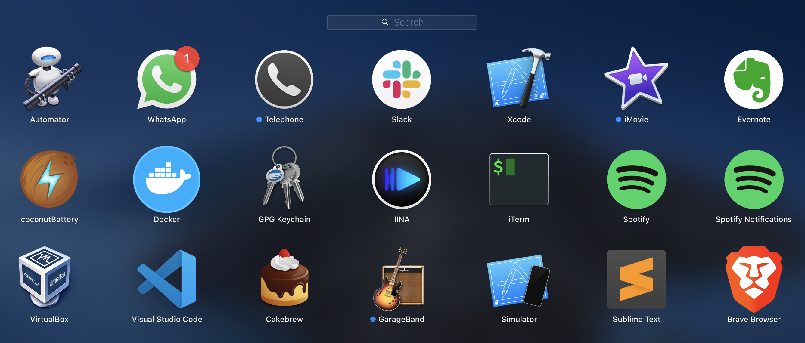

# Mac Development Ansible Playbook

This playbook installs and configures most of the software I use on my Mac for web and software development. Some things in macOS are slightly difficult to automate, so I still have some manual installation steps, but at least it's all documented here.

This is a work in progress, and is mostly a means for me to document my current Mac's setup. I'll be evolving this set of playbooks over time.

*See also*:

  - [Boxen](https://github.com/boxen)
  - [Battleschool](http://spencer.gibb.us/blog/2014/02/03/introducing-battleschool)
  - [osxc](https://github.com/osxc)
  - [MWGriffin/ansible-playbooks](https://github.com/MWGriffin/ansible-playbooks) (the original inspiration for this project)

## Installation

  1. Ensure Apple's command line tools are installed (`xcode-select --install` to launch the installer).
  2. [Install Ansible](http://docs.ansible.com/intro_installation.html).
  3. Clone this repository to your local drive.
  4. Run `$ ansible-galaxy install -r requirements.yml` inside this directory to install required Ansible roles.
  5. Run `ansible-playbook main.yml -i inventory -K` inside this directory. Enter your account password when prompted.

> Note: If some Homebrew commands fail, you might need to agree to Xcode's license or fix some other Brew issue. Run `brew doctor` to see if this is the case.

### Running a specific set of tagged tasks

You can filter which part of the provisioning process to run by specifying a set of tags using `ansible-playbook`'s `--tags` flag. The tags available are `dotfiles`, `homebrew`, `mas`, `extra-packages` and `osx`.

    ansible-playbook main.yml -i inventory -K --tags "dotfiles,homebrew"

## Included Applications / Configuration (Default)

Applications (installed with Homebrew Cask):

  - [brave-browser](https://brave.com)
  - [cakebrew](https://www.cakebrew.com)
  - [coconutbattery](https://www.coconut-flavour.com/coconutbattery/)
  - [docker](https://www.docker.com)
  - [google-cloud-sdk](https://cloud.google.com/sdk/)
  - [gpg-suite](https://gpgtools.org)
  - [iina](https://iina.io)
  - [iterm2](https://iterm2.com)
  - [slack](https://slack.com/)
  - [spotify](https://www.spotify.com) with spotify-notifications
  - [sublime-text](https://www.sublimetext.com)
  - [virtualbox](https://www.virtualbox.org)
  - [visual-studio-code](https://code.visualstudio.com)

Packages (installed with Homebrew):

  - asciinema
  - asdf
  - awscli
  - axel
  - cmatrix
  - coreutils
  - cowsay
  - docker-machine
  - docker-machine-driver-hyperkit
  - docker-machine-driver-xhyve
  - figlet
  - findutils
  - git
  - git-lfs
  - go
  - grep
  - helm@2
  - hostess
  - iftop
  - jq
  - kompose
  - kubernetes-cli
  - kubernetes-helm
  - kube-ps1
  - mas
  - midnight-commander
  - minikube
  - moreutils
  - node
  - p7zip
  - pandoc
  - screen
  - ssh-copy-id
  - sshuttle
  - tcpflow
  - tree
  - tmux
  - unrar
  - velero
  - watch
  - wget
  - youtube-dl

My [dotfiles](https://github.com/cristian04/dotfiles-1.git) are also installed into the current user's home directory, including the `.macos` dotfile for configuring many aspects of macOS for better performance and ease of use. You can disable dotfiles management by setting `configure_dotfiles: no` in your configuration.

## Author

[Cristian Marquez Russo](https://www.cristianmarquez.me) inspired by [Jeff Geerling](https://www.jeffgeerling.com/), 2014 (originally inspired by [MWGriffin/ansible-playbooks](https://github.com/MWGriffin/ansible-playbooks)).
