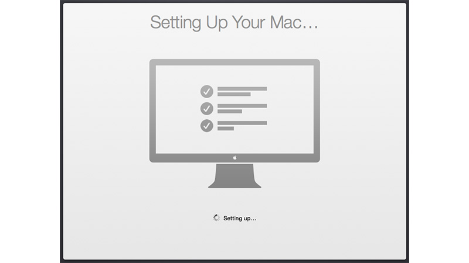

# Mac Development Ansible Playbook



This playbook setups and configures Mac's in an automated and standard way, it should be run on new Mac's and periodically on existing Mac's.

## Installation

  1. Ensure Apple's command line tools are installed (`xcode-select --install` to launch the installer).
  2. [Install Ansible](https://docs.ansible.com/ansible/latest/installation_guide/index.html):

     1. Run the following command to add Python 3 to your $PATH: `export PATH="/opt/homebrew/bin:$HOME/Library/Python/3.9/bin:$PATH"`
     2. Upgrade Pip: `sudo pip3 install --upgrade pip`
     3. Install Ansible: `pip3 install ansible`

  3. Clone or download this repository to your local drive.
  4. Run `ansible-galaxy install -r requirements.yml` inside this directory to install required Ansible roles.
  5. Run `ansible-playbook main.yml -K` inside this directory. Enter your macOS account password when prompted for the 'BECOME' password.

> Note: If some Homebrew commands fail, you might need to agree to Xcode's license or fix some other Brew issue. Run `brew doctor` to see if this is the case.

### Running a specific set of tagged tasks

You can filter which part of the provisioning process to run by specifying a set of tags using `ansible-playbook`'s `--tags` flag. The tags available are `dotfiles`, `homebrew`, `mas`, `extra-packages` and `osx`.

    ansible-playbook main.yml -K --tags "dotfiles,homebrew"

## Overriding Defaults

Not everyone's development environment and preferred software configuration is the same.

You can override any of the defaults configured in `default.config.yml` by creating a `config.yml` file and setting the overrides in that file. For example, you can customize the installed packages and apps with something like:

```yaml
homebrew_installed_packages:
  - cowsay
  - git
  - go

mas_installed_apps:
  - { id: 443987910, name: "1Password" }
  - { id: 498486288, name: "Quick Resizer" }
  - { id: 557168941, name: "Tweetbot" }
  - { id: 497799835, name: "Xcode" }

composer_packages:
  - name: hirak/prestissimo
  - name: drush/drush
    version: '^8.1'

gem_packages:
  - name: bundler
    state: latest

npm_packages:
  - name: webpack

pip_packages:
  - name: mkdocs

configure_dock: true
dockitems_remove:
  - Launchpad
  - TV
dockitems_persist:
  - name: "Sublime Text"
    path: "/Applications/Sublime Text.app/"
    pos: 5
```

Any variable can be overridden in `config.yml`; see the supporting roles' documentation for a complete list of available variables.

## Included Applications / Configuration (Default)

Applications (installed with Homebrew Cask):

  - [ChromeDriver](https://sites.google.com/chromium.org/driver/)
  - [Docker](https://www.docker.com/)
  - [Dropbox](https://www.dropbox.com/)
  - [Firefox](https://www.mozilla.org/en-US/firefox/new/)
  - [Google Chrome](https://www.google.com/chrome/)
  - [Handbrake](https://handbrake.fr/)
  - [Homebrew](http://brew.sh/)
  - [LICEcap](http://www.cockos.com/licecap/)
  - [LimeChat](http://limechat.net/mac/)
  - [MacVim](http://macvim-dev.github.io/macvim/)
  - [nvALT](http://brettterpstra.com/projects/nvalt/)
  - [Sequel Ace](https://sequel-ace.com) (MySQL client)
  - [Skitch](https://evernote.com/skitch/)
  - [Slack](https://slack.com/)
  - [Sublime Text](https://www.sublimetext.com/)
  - [Transmit](https://panic.com/transmit/) (S/FTP client)
  - [Vagrant](https://www.vagrantup.com/)

Packages (installed with Homebrew):

  - autoconf
  - bash-completion
  - doxygen
  - gettext
  - gifsicle
  - git
  - go
  - gpg
  - hub
  - httpie
  - iperf
  - libevent
  - sqlite
  - mcrypt
  - nmap
  - node
  - nvm
  - php
  - ssh-copy-id
  - cowsay
  - readline
  - openssl
  - pv
  - wget

My [dotfiles](https://github.com/sculley/dotfiles) are also installed into the current user's home directory, including the `.osx` dotfile for configuring many aspects of macOS for better performance and ease of use. You can disable dotfiles management by setting `configure_dotfiles: no` in your configuration.

Finally, there are a few other preferences and settings added on for various apps and services.

## Future additions

### Things that still need to be done manually

It's my hope that I can get the rest of these things wrapped up into Ansible playbooks soon, but for now, these steps need to be completed manually (assuming you already have Xcode and Ansible installed, and have run this playbook).

  1. Set JJG-Term as the default Terminal theme (it's installed, but not set as default automatically).
  3. Install all the apps that aren't yet in this setup (see below).
  4. Remap Caps Lock to Escape (requires macOS Sierra 10.12.1+).
  5. Set trackpad tracking rate.
  6. Set mouse tracking rate.
  7. Configure extra Mail and/or Calendar accounts (e.g. Google, Exchange, etc.).

### Configuration to be added:

  - I have vim configuration in the repo, but I still need to add the actual installation:
    ```
    mkdir -p ~/.vim/autoload
    mkdir -p ~/.vim/bundle
    cd ~/.vim/autoload
    curl https://raw.githubusercontent.com/tpope/vim-pathogen/master/autoload/pathogen.vim > pathogen.vim
    cd ~/.vim/bundle
    git clone git://github.com/scrooloose/nerdtree.git
    ```

## Testing the Playbook

Many people have asked me if I often wipe my entire workstation and start from scratch just to test changes to the playbook. Nope! Instead, I posted instructions for how I build a [Mac OS X VirtualBox VM](https://github.com/sculley/mac-osx-virtualbox-vm), on which I can continually run and re-run this playbook to test changes and make sure things work correctly.

Additionally, this project is [continuously tested on GitHub Actions' macOS infrastructure](https://github.com/sculley/mac-dev-playbook/actions?query=workflow%3ACI).

## Author

This project is maintained and managed by [Sam Culley](https://github.com/sculley) and originally created by [Jeff Geerling](https://www.jeffgeerling.com/) (originally inspired by [MWGriffin/ansible-playbooks](https://github.com/MWGriffin/ansible-playbooks)).

[badge-gh-actions]: https://github.com/sculley/mac-dev-playbook/workflows/CI/badge.svg?event=push
[link-gh-actions]: https://github.com/sculley/mac-dev-playbook/actions?query=workflow%3ACI
