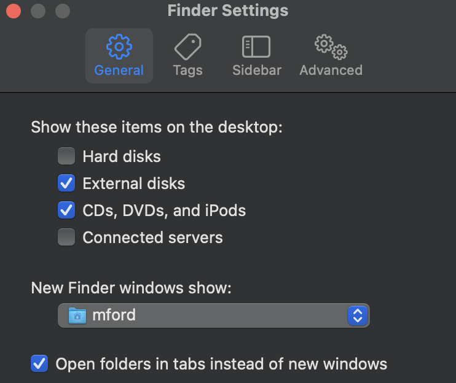
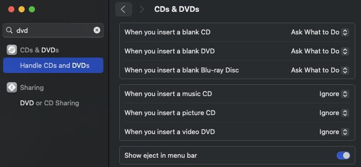

# Full Mac Setup Process (for Michael Ford)

There are some things in life that just can't be automated... or aren't 100% worth the time :(

This document covers that, at least in terms of setting up a brand new Mac out of the box.

These instructions assume that the playbook and ansible are installed on a remote linux machine.

the default location for all necessary files in Dropbox is: `/Dropbox/My Documents/Mac Ansible Restore`

## Initial configuration of a brand new Mac

### Pre-automation Tasks
Before starting, I completed Apple's mandatory macOS setup wizard (creating a local user account, and optionally signing into my iCloud account). Once on the macOS desktop, I do the following (in order):

  - SSH setup.
    - Manually copy any shared SSH keys that are needed to log into the remote Ansible machine, from Dropbox (via Airdrop or Web GUI)
  - Turn on `Remote Login` and `Screen Sharing` in Settings on Target Mac
  - Ensure that the approprpiate SSH Private key that allows remote access is populated in ~/.ssh/authorized_keys
  - Sign into:
    - iCloud
    - iMessage
    - Mac App Store
  - Ensure Apple's command line tools are installed (`xcode-select --install` to launch the installer)
  - Install homebrew:
    - `$ /bin/bash -c "$(curl -fsSL https://raw.githubusercontent.com/Homebrew/install/HEAD/install.sh)"`
  - Install the ansible collections and roles required:
    - `$ ansible-galaxy install -r <repository root>/requirements.yml`
  - Make the following role tweaks:
    - **<repository root>/roles/geerlingguy.dotfiles/tasks/main.yml**:
      - For the task `Ensure dotfiles repository is cloned locally`, add `force: true` to the git module arguments.
        - 
            ```
            - name: Ensure dotfiles repository is cloned locally.
              git:
                repo: "{{ dotfiles_repo }}"
                dest: "{{ dotfiles_repo_local_destination }}"
                version: "{{ dotfiles_repo_version }}"
                accept_hostkey: "{{ dotfiles_repo_accept_hostkey }}"
                force: true
              become: false
            ```
    - **<repository root>/roles/ansible-role-dock/tasks/remove.yml**:
      - Comment out the task `Dockutil | Removing items`.
        - 
            ```
            # - name: Dockutil | Removing items
            #   ansible.builtin.shell: "{{ lookup('template', './templates/remove.j2') | replace('\n', '') | trim }}"
            #   loop_control:
            #     label: "{{ item.item }}"
            #   changed_when: false
            #   when: dock_dockitems_to_remove is defined and (dock_dockitems_to_remove | length > 0)
            #   tags:
            #     - dock-remove
            ```

### Automated Installations

  - Ensure that config.yml is in the cloned repository, sourced from Dropbox.
  - Run the playbook remotely with `--tags homebrew, sudoers`.
    - `$ ansible-playbook main.yml  --tags "homebrew,sudoers"`
    - If there are errors, you may need to finish up other tasks like installing 'old-fashioned' apps first
  - Install old-fashioned apps:
    - Install [Insta360 Link](https://www.insta360.com/download/insta360-link)
    - Install [Google Chat](https://chat.google.com/download/) from within Brave Browser
    - Install [VMWare Fusion Player](https://customerconnect.vmware.com/en/evalcenter?p=fusion-player-personal-13) (dmg file and licence are in DropBox)
  - Set up Dropbox and sync the following folders:
    - `/Dropbox/apps/`
    - `/Dropbox/My Documents/Macbook Ansible Restore/`
  - Run the playbook remotely with `--skip-tags homebrew, post`.
    - `$ ansible-playbook main.yml  --skip-tags "homebrew,post"`
    - NOTE: The Dock may not show updates after this; in order to show the changes, run the following command in the Mac Terminal:
      - `killall Dock`
      - This command will terminate the Dock process, and macOS will automatically restart it. Any changes applied to the Dock should be resolved after this command.

  ### Post Automation Manual Processes
    - Finder Settings:
      - Use the Terminal to permanently set hidden files to show in Finder
        - `$ defaults write com.apple.Finder AppleShowAllFiles true`
        - `$ killall Finder`
      - Remove Recent from Finder sidebar
      - In Finder settings, check the box `Show all filename extensions` and set `New Finder windows show` to the home folder.
        - 
    - Logi Options:
      - Complete all settings for the MX 3S Mouse. All the images that show desired settings can be found [here](./images/logi_options/)
    - System Settings
      - Wi-Fi
        - Set Wireless SSID and DNS Server to Pihole
      - Privacy & Security
        - Privacy
          - Screen Recording
            - Give the following apps permissions
              - Amazon Chime
              - Brave Browser
              - FaceTime
              - Google Chrome
              - Microsoft Teams
              - WebEx
              - zoom.us
      - Desktop & Dock
        - Show recent applications in dock: `disabled`
        - Hot Corners
          - Upper Left: `Notification Center`
          - Lower Left: `Lock Screen`
          - Upper Right: `-`
          - Lower Right: `Put Display to Sleep` 
      - Touch ID & Password
        - Add Fingerprints for TouchID
        - Allow Apple Watch to Unlock Mac   
      - Internet Accounts
        - Set up Google Account and sync contacts and calendar with Mac
      - Trackpad
        - Tap to Click: `Enabled`
          - Tap with one finger
        - App Exposé: `Swipe Down with Four Fingers`
      - Open at Login:
        - Open at Login:
          - AlDente.app (if a laptop)
          - Dropbox.app
          - Rectangle.app
        - Allow in the Background:
          - 1Password.app
          - AlDente
          - Docker.app
          - Dropbox
          - ExpressVPN
          - Logi Options+
          - Microsoft Office Licensing
          - Spotify.app
          - Wireguard.app
          - zoom.us.app
    - iMessage
      - Turn off sound for iMessage
    - Google Chrome/Brave Browser:
      - Install Google Chrome/Brave Browser extensions (list in DropBox)
      - Import Google Chrome/Brave Browser bookmarks from Dropbox
      - Set Brave Browser to default
      - Set Brave Browser default search engine to Google
    - Configure Wireguard
      - retrieve peer files from Shared Google Drive folder "Wireguard Clients"
    - Sign into Slack workspaces (list in DropBox)
    - Apps to Authenticate with License Keys (list in DropBox):
      - ExpressVPN
      - DaisyDisk
      - Al Dente
      - makemkv
  - Add folders to sidebar in Finder:
    - ~/Dropbox
    - ~/.ssh
    - ~/git-workspace
    - ~/.kube
    - ~/Library/Caches
  - Add remote machine information for vscode (from Dropbox)
    - Destination: ~/.ssh/remote-hosts/config
  - Change Optical Drive Settings:
    - 
  - Run the playbook remotely with `--tags post`.
    - `$ ansible-playbook main.yml  --tags "post"

### Macbook-specific manual configuration
- AlDente:
  - Settings --> Charge:
    - Stop Charging when sleeping: `Enabled`
    - Hardware Battery Percentage: `Enabled`
  - Settings --> Features:
    - Menubar Right Click: `Do Nothing`

## To Wrap in Post-provision automation

The following tasks have to wait for the initial Dropbox sync to complete before they'll succeed. So ideally I'll stick this all in a post-provision script but somehow flag it not to run on first provision.

```
# git settings
- Add Git credentials

#Install Ansible in Virtual Environment
`$ source ~/venvs/ansible/bin/activate`
`(ansible)$ pip install --upgrade pip`
`(ansible)$ pip install ansible-core==2.14.1` (as of this writing; see a list of ansible core releases [here](https://pypi.org/project/ansible-core/#history))

```

## When formatting old Mac
  - Deauthorize Apple Music in iTunes/Music App
  - Deauthorize ExpressVPN
  - Deauthorize CleanMyMac
  - Follow Apple's guide (TODO)

## Todo list for post provision automation
- Add SSH keys to ~/.ssh and change permissions to 0600
